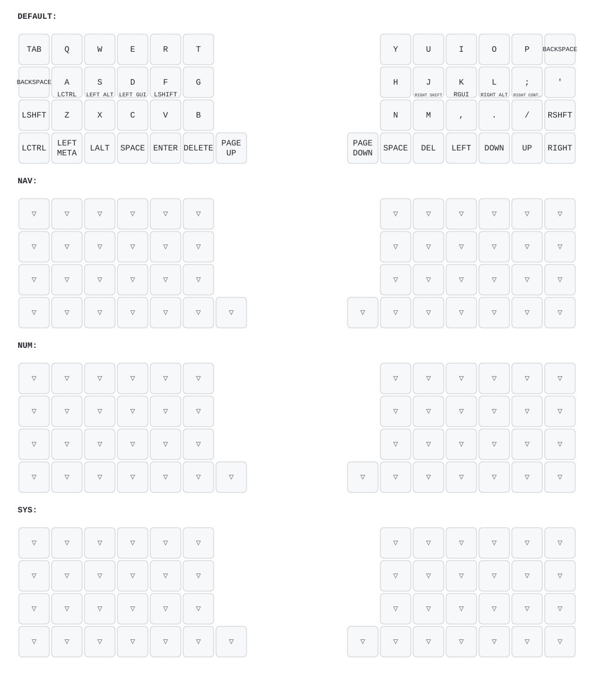

# FelixKeeb

FelixKeeb 是一把开源的 5x12+4 分体正交键盘：左右两侧各为 5x6+2。键盘提供 MX 与 Choc 两个版本，最下面一行支持拆分，可组装为更小巧的 mini 版本。

## 特性

- 分体正交布局：5x12+4，左右各 5x6+2。
- 轴体版本：支持 MX 版本和 Choc 版本。
- Mini 形态：最下面一行支持拆分，可按需组装为 mini 版本。
- 主控：nice!nano / nice!nano v2。
- 电池：推荐 401230 规格锂电池。
- 显示屏：支持 nice!view 或 OLED。
- 固件：基于 ZMK，支持蓝牙无线使用。
- 改键：支持 ZMK Studio，也支持 [Nick Coutsos Keymap Editor](https://nickcoutsos.github.io/keymap-editor/)。

## 分支说明

| 分支 | 说明 |
| --- | --- |
| `master` | 5x12+4 标准版本 |
| `36` | 4x12+2 版本 |
| `prospector-dongle` | 5x12+4 dongle 版本，接收器使用 [prospector](https://github.com/carrefinho/prospector) |

## 默认布局

默认键位图见 [keymap-drawer/felix.svg](keymap-drawer/felix.svg)。

键位源码位于 [config/felix.keymap](config/felix.keymap)，键盘布局 JSON 位于 [config/felix.json](config/felix.json)。

## 在线改键

你可以使用以下工具调整键位：

- [ZMK Studio](https://zmk.dev/docs/features/studio)
- [Nick Coutsos Keymap Editor](https://nickcoutsos.github.io/keymap-editor/)

本仓库的构建配置已经包含 ZMK Studio 所需的 `studio-rpc-usb-uart` snippet。

## 固件构建

GitHub Actions 会根据 [build.yaml](build.yaml) 生成构建矩阵，默认构建以下固件：

- `felix_left nice_oled`
- `felix_right nice_oled`
- `settings_reset`
- `felix_left nice_view_adapter nice_epaper`
- `felix_right nice_view_adapter nice_epaper`

刷写前请根据自己的硬件版本选择对应的构建产物。

## 硬件配置

| 项目 | 配置 |
| --- | --- |
| 键盘类型 | 分体正交 |
| 布局 | 5x12+4，左右各 5x6+2 |
| 主控 | nice!nano / nice!nano v2 |
| 电池 | 401230 |
| 显示屏 | nice!view / OLED |
| 固件 | ZMK |
| 改键工具 | ZMK Studio / Nick Coutsos Keymap Editor |

## 致谢

FelixKeeb 基于 ZMK 生态构建，感谢 ZMK 项目、nice!nano、nice!view 以及社区中所有开源硬件与固件贡献者。
